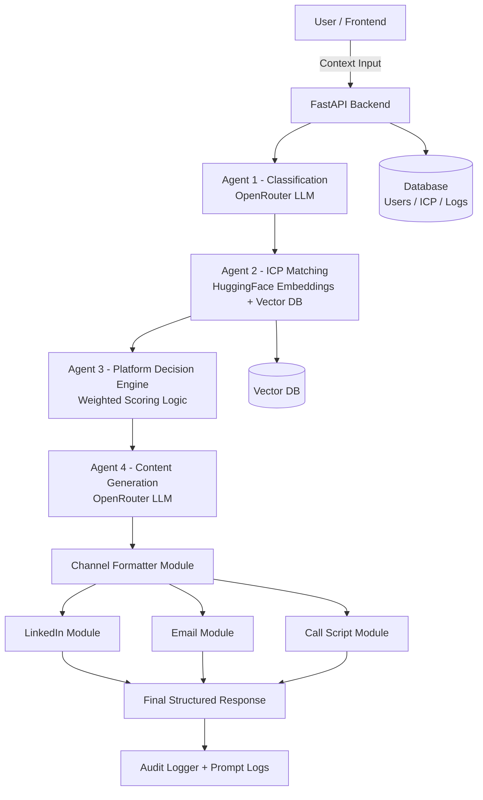
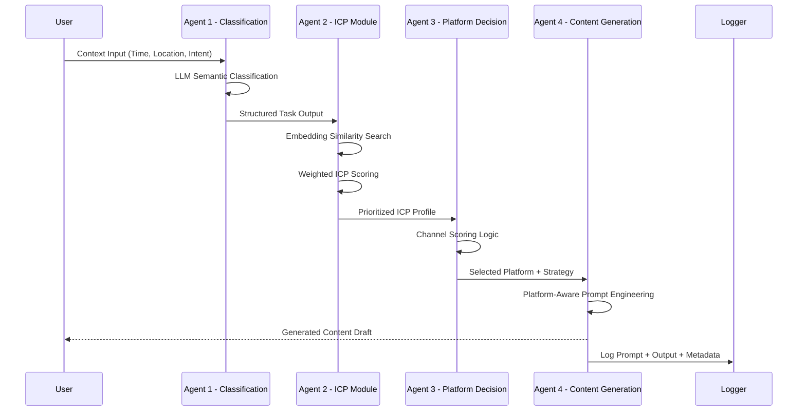
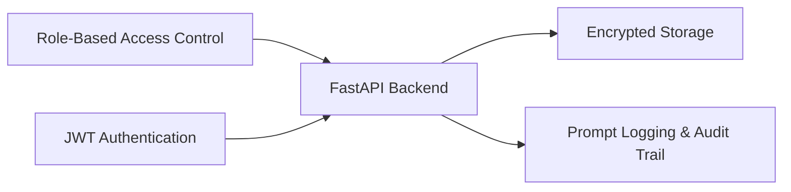

# Multi-Agent Model Diagrams

The following diagrams illustrate the architecture and data flow of the Multi-Agent Content Generator.

## 1. System Architecture (Flowchart)

This diagram shows the high-level components and how data moves from the user through the four specialized agents to the final output modules.

## 2. Agent Execution Sequence

This sequence diagram details the step-by-step logic and handoffs between the agents during a single campaign generation request.

## 3. Security & Governance Layer

This diagram shows the cross-cutting concerns like Authentication and Logging that protect the API.

